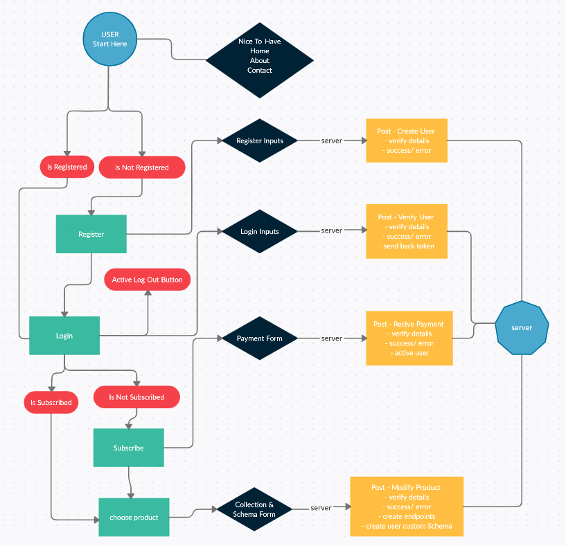

# mock-api-final-project

• npm install 

• npm run client-install 

    const Project!

function projectPlanning (idea) {
  
  const result = "awesome"

This project has both back-end and front-end. 
Front-end will be writen using React, Css and JS.
Back-end will be based on mongoDB using mongoose, on NodeJS.

The idea is a mock api: it offers itself to the users as a server, including server actions: 
start your own api with collections, passwords and validations.

MusTo Have:
The purpose of the back-end is to be secured, and offer itself as first basically with an option to Register, and have your own end-point(probably with Routes).

NiceTo Have:
And idealy(depends on development time), to offer as similar experience as any mockApi system.

  return result

}

------------------------------------

Stages:
- planning widely (all parts, especially unknown)
- planning deeply(all steps)
- const times (schedule)

Key goals:
- add tests
- commit to Github often
- clear code with notes
- quick design (possibly with external libraries)

------------------------------------

## section 1 :  planning widely (mark unknowns)

    - design idea (draw)
    - basic components
    - mongo endpoint
    - authentication / unknown
    - user register and login (with credentials) / unknown
    - basic interface with mockApi functionality (must to have) / unknown
    - design

***verify key points (tests, github, code notes, avoid design margin)***

------------------------------------

## section 2 :  planning deeply (all steps)

- design idea (draw) :

      - draw pages, components and concepts.

      - understand mockApi idea (project core) :
        - design backend
        - authentication
        - User Schema
        - load users data

      - design user functionality :
        - users options
        - security
        - unique end-point
        - API Schema and collections per user
        - load users data (self made API's with data)

- basic components :

      - HOME
      - Register
      - Login
      - Server user's stuff (data, options, guide)
      - Utilities
      - About
      - Contact (form)

- mongo endpoint :

      - Initialize webApp endpoint (users collection)
      - create users endpoints(users data functionality)

- authentication / unknown :

      - healthy connection between my app to mongoDB, verification 
      - Users Schema

- user register and login (with credentials) / unknown :

      - all the way to mongoDB // edit after research

- basic interface with mockApi functionality (must to have) / unknown :

      - all the way to mongoDB // edit after research
      - Dinamic Schemas for users?

- design :

      - Nice to have (all functionality must work in UI) // check later

	***verify key points (tests, github, code notes, avoid design margin)***

------------------------------------

## section 3 :  const times (schedule)

    - design idea (draw) - 1 Hour
    - basic components - 1 Hour
    - mongo endpoint - 1 Hour
    - authentication :user register and login (with credentials) / unknown :update times after starting. assumption 3-5 Hours
    - Subscription With Payment (NiceToHave)
    - product interface with mockApi functionality (must to have) / unknown. update times after starting per each stage. Project Core :
      - Flexible Schema Per User // Use Switch
      - create Route end-points for user // React Modified Route + mongo UsersData end-points
      - desplay user stored data // Component of victorious !
    - design (NiceToHave)

***verify key points (tests, github, code notes, avoid design margin)***

------------------------------------

*Manage time and effort correctly and wisely;*
*Win the "unknown" barrier;*

